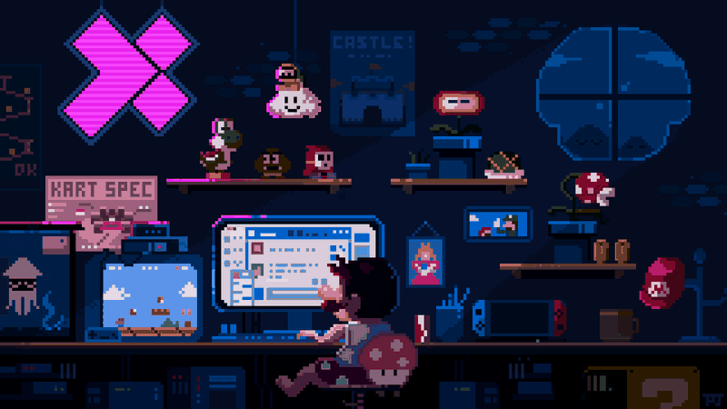

<h1 align="center">Patriki de Oliveira Góss</h1>

  <strong>Estudante de Ciência da Computação no IFSC</strong>

  Desenvolvimento de aplicações web, APIs REST e Análise de dados.

  

## Sobre mim

Sou estudante de **Ciência da Computação no IFSC**, com experiência no desenvolvimento de aplicações web e APIs.

Tenho trabalhado principalmente com **Python, Django, JavaScript, Vue.js e React**, além de bancos de dados relacionais, autenticação, testes automatizados, CI/CD e deploy de aplicações.

---

## Projetos

**[Gestão de Impressão 3D](https://github.com/PatrikiGss/gestao_Impressao3D)** — sistema de solicitação e acompanhamento de impressões para o projeto de extensão de mapeamento tátil do IFSC Campus Lages. Django, PostgreSQL, CI/CD e deploy em produção.

**[Gestão Pecuária](https://github.com/PatrikiGss/Projeto-gestao-pecuaria)** — software desenvolvido para o projeto de pesquisa de Gestão Pecuária do IFSC Campus Lages.

**[ACAPRA](https://github.com/PatrikiGss/Projeto_Acapra)** — aplicação feita para a instituição ACAPRA de São Joaquim, na disciplina de Atividade de Extensão II.

**[Romaneio](https://github.com/PatrikiGss/Site_romaneio_Kauan)** — aplicação sob medida para romaneio, desenvolvida conforme as necessidades do cliente.

---

## Tecnologias

### Backend

  

### Frontend

  

### Ferramentas

  

 

---

## Atividade

  

---

## Estatísticas

  
  

  

---

## Contato

  
  
  

